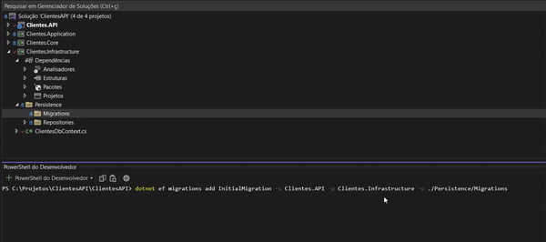

# ClientesAPI

Desenvolvimento de uma API de clientes utilizando boas práticas de desenvolvimento e arquitetura de sistemas.
Como documentação optei por utilizar o **Swagger**.
Nessa Api é permitido realizar as operações básicas de um sistema (Create,Read,Update e Delete).
Até o momento o projeto contém:
- Padrão de Arquitetura Limpa ( Onion Architecture ).
- Endpoints Básicos da API (CRUD).
- Relacionamento com o Contexto de Dados utilizando Interfaces(Padrão Repository).
- Design Pattern **Mediator** utilizando **CQRS** e a biblioteca MediatR.
- Métodos Assincronos.
- Validações de e-mail e CPF nos EndPoints da API utilizando **Fluent Validation**
- Relacionamento com o banco de dados SQLServer utilizando o **EntityFrameWorkCore**.


### Configurando o SQLServer(Migrations)

Para iniciar usando o banco de dados SQLServer:

```bash
Abra o terminal PowerShell(cmd) na pasta inicial do projeto(ClientesAPI,onde se encontra a solução e o Readme).

Execute os comandos:

- dotnet ef migrations add InitialMigration -s Clientes.API -p Clientes.Infrastructure -o ./Persistence/Migrations
- dotnet ef database update -s Clientes.API

```
<h1 align="center">
  
</h1>

###### Dica! 
 Exemplos de clientes disponíveis na pasta ./Clientes.API/Assets/ 
