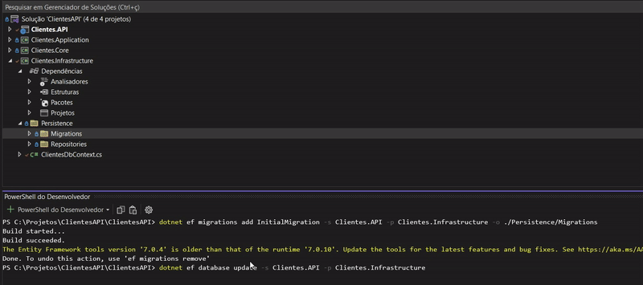
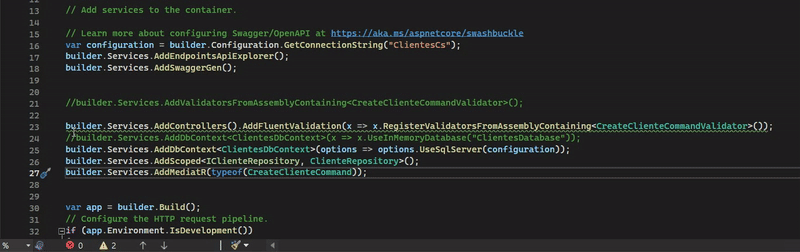

# ClientesAPI

Desenvolvimento de uma API de clientes utilizando boas práticas de desenvolvimento e arquitetura de sistemas.
Como documentação optei por utilizar o **Swagger**.
Nessa Api é permitido realizar as operações básicas de um sistema (Create,Read,Update e Delete).
Até o momento o projeto contém:
- Padrão de Arquitetura Limpa ( Onion Architecture ).
- Endpoints Básicos da API (CRUD).
- Relacionamento com o Contexto de Dados utilizando Interfaces(Padrão Repository).
- Design Pattern **Mediator** utilizando **CQRS** e a biblioteca MediatR.
- Métodos Assincronos.
- Validações de e-mail e CPF nos EndPoints da API utilizando **Fluent Validation**
- Relacionamento com o banco de dados SQLServer utilizando o **EntityFrameWorkCore**.
- Implementação de login na API utilizando **Jason Web Token** e **Bearer**

### Configurando o SQLServer(Migrations)

Para iniciar usando o banco de dados SQLServer:

```bash
Abra o terminal PowerShell(cmd) na pasta inicial do projeto(ClientesAPI,onde se encontra a solução e o Readme).

Execute o comando:

- dotnet ef database update -s Clientes.API

Se houver algum erro na criação do banco de dados, execute os comandos:

- dotnet ef migrations remove -s Clientes.API -p Clientes.Infrastructure
- dotnet ef migrations add InitialMigration -s Clientes.API -p Clientes.Infrastructure -o ./Persistence/Migrations
- dotnet ef database update -s Clientes.API

Lembre-se de verificar se o seu serviço do SQL está ativo e se a string de conexão em ./Clientes.API/appsettings.json está correta.
```
<h1 align="center">
  
</h1>

### Como Logar na Aplicação Utilizando o Bearer!

- Com a aplicação executando, na area de usuários execute o método Post(api/Usuarios) Preenchendo os campos de Login e Senha conforme a imagem abaixo:
<h1 align="center">
  
</h1>

- Em seguida, no método Put(api/Usuarios/login), preencha os dados de email e senha conforme a imagem abaixo:
<h1 align="center">
  
</h1>

- No resultado da operação, Copie o Token sem as aspas("")  no retorno da API.
- Em seguida, basta abrir o botão *Authorize* no início da página e digitar Bearer seguido de um espaço ' ' e colar o token gerado anteriormente.
EX: ***Bearer eyJhbGciOiJIUzI1NiIs.......OiJhbG***
<h1 align="center">
  
</h1>

#### - E pronto! Está liberado todos os Endpoints da API! 

### Dicas! 
 Exemplos de clientes disponíveis na pasta ./Clientes.API/Assets/.<br>
 É possivel Executar sem o SQLServer, para isso, Em ./Clientes.API/Program.cs:
 - commente a linha 55 que menciona a opção: _**options.UseSqlServer(configuration))**_
 - Descomente a linha 54 que menciona a opção: _**x.UseInMemoryDatabase("ClientesDatabase"))**_

 <h1 align="center">
  
</h1>